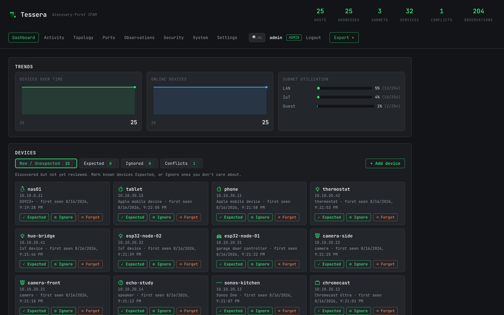
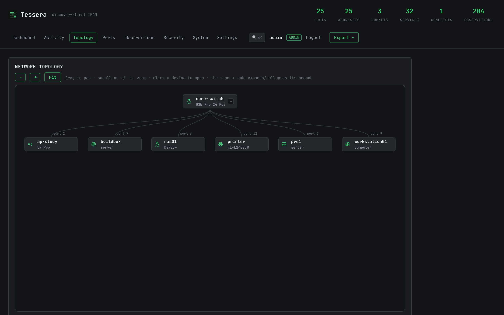
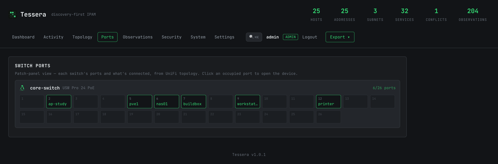
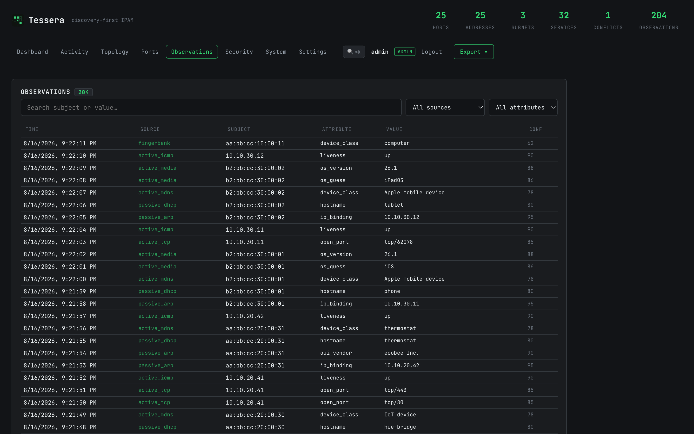

# Tessera

**Discovery-first IPAM for home labs and small networks.**

A *tessera* is one of the small tiles a mosaic is built from. Tessera the daemon
assembles a full picture of your **address space** — who holds which IP, on which
subnet/VLAN, on what device — out of thousands of small observed pieces, and
**discovers the records itself** instead of asking a human to type them in.

Traditional IPAM is a database a human seeds and curates. Tessera is a
**continuously reconciled view of what is actually on the wire**, assembled from
passive and active signals, that a human then *annotates and corrects*.

- **Open source, self-hosted, single static binary** (pure-Go SQLite, no cgo).
- **Read-only toward the network.** Tessera observes and probes; it never writes
  to switches, controllers, DHCP, or any device.
- **No phone-home, no telemetry.** Observation data never leaves the host except
  for explicitly configured, opt-in external lookups (Fingerbank — off by default).

> **Status: M8 — feature-complete.** All milestones done: observation log + entity
> schema (M1), §3.3 reconciliation engine (M2), UniFi poller (M3.5), passive sensor
> (M3), active prober (M4), Fingerbank enrichment (M5), read API + web UI (M6),
> export/interop (M7), and hardening + deploy (M8 — API token auth, bind-safety
> refusal, port fail-fast, backpressure-tolerant write path, and GoReleaser
> multi-arch releases with `.deb`/`.rpm`/`.apk` + systemd + Docker).

## What it looks like

The inventory after a sweep — what was found, what is new, and what still needs
a human's eye. Nothing is typed in; every row was discovered.



Switch topology, reconstructed from the controller's port↔MAC mapping, and the
patch-panel view of the same data:




And the part that makes the rest trustworthy — the raw observation log every
conclusion is folded from, filterable by source, subject and attribute:



> These are captured from `tessera demo -full`, which seeds an invented network
> — no address, hostname or device above belongs to anyone. Run it yourself to
> get the same inventory in about a second, without pointing Tessera at anything
> you own.

## Architecture — the one rule

There is **one append-only observation log**, and **every collector writes to it
in the same shape**. The reconciliation engine reads the log and folds it into
current entities. Nothing else talks to the entity tables directly.

```
 collectors (many)            one sink              derived state
  passive sensor  ┐
  active prober   ┤
  UniFi poller    ┼──▶  observation log  ──▶  reconciliation  ──▶  entities
  Fingerbank      ┤      (append-only)          engine            (hosts, addrs,
  manual          ┘                                                 subnets, …)
                                                                        │
                                                                        ▼
                                                              query API / UI / export
```

The entity layer is **fully rebuildable by replaying the log from empty** — this
is an enforced invariant, not an aspiration.

## Build & run

Requires Go 1.26+.

The default build is **pure Go** (no cgo) and produces a single static binary,
but it cannot capture packets. To enable the **passive sensor**, build with the
`pcap` tag, which links libpcap (and so needs libpcap headers + a C toolchain):

```sh
go build -tags pcap -o tessera ./cmd/tessera   # passive sensor enabled (needs libpcap)
```

The pure-Go build still runs everything else (UniFi poller, reconciliation,
API/export); the sensor simply logs that capture is unavailable.

```sh
go build -o tessera ./cmd/tessera   # pure Go, no capture

# See the whole pipeline without touching a network: seed synthetic
# observations through the real write path, reconcile, print entities.
./tessera demo -config configs/tessera.example.yaml

# -full seeds a larger invented network (25 devices, 3 subnets, services,
# topology and a real disagreement) — enough to explore the UI with.
./tessera demo -full -config configs/tessera.example.yaml

# Apply schema migrations and exit.
./tessera migrate -config configs/tessera.example.yaml

# Export the inventory (JSON/CSV, or NetBox/phpIPAM import files).
./tessera export -config configs/tessera.example.yaml -list
./tessera export -config configs/tessera.example.yaml -format netbox-ips.csv -out ips.csv

# Run the daemon (reconcile loop; Ctrl-C for graceful shutdown).
./tessera run -config configs/tessera.example.yaml
```

With the daemon running, the inventory UI + read API are at **http://<host>:10404**
(it binds all interfaces by default; set `api.listen_addr: 127.0.0.1:10404` for
localhost-only). The UI shows the inventory,
per-host detail with full observation-history provenance, conflicts, new/unexpected
devices, and lets you annotate hosts (name, device class, "expected", notes) — those
annotations are authoritative and survive future discovery.

Secrets are supplied via the environment only, never the config file:
`TESSERA_UNIFI_PASSWORD`, `TESSERA_UNIFI_API_KEY`, `TESSERA_FINGERBANK_KEY`,
`TESSERA_SNMP_COMMUNITY`, `TESSERA_API_TOKEN`.

## System requirements

Tessera is light — it's idle between cycles (UniFi poll 5m, probe sweep 15m,
reconcile 30s), and the reconciler *streams* the log rather than loading it, so
memory tracks the number of devices, not the log size.

| | Minimum | Recommended | Passive sensor on a busy SPAN |
|---|---|---|---|
| **CPU** | 1 vCPU | 1–2 vCPU | 2 vCPU |
| **RAM** | 256 MB | 512 MB – 1 GB | 1 GB+ |
| **Disk** | 2 GB | 8 GB | 8 GB+ |

Idle RAM is typically ~50–150 MB. **Disk is driven by the append-only observation
log** — pollers re-emit the same facts each cycle, so the log would grow ~0.1–0.5
GB/month for a typical UniFi + active-probe `/24`. To bound it, Tessera runs
**log compaction** every `reconcile.compact_interval` (default 6h), collapsing
repeated identical observations to their first + latest occurrence (which keeps
first-seen/last-seen and the reconciled result exact). For a Proxmox CT, **1 vCPU
/ 1 GB RAM / 8 GB disk** is a comfortable starting point. `tessera setup` warns
if free disk or memory is below the recommended floor.

## Deploy

Releases ship a pure-Go static binary for `linux/amd64` and `linux/arm64`, plus
`.deb` / `.rpm` / `.apk` packages and tarballs (built with GoReleaser).

### Debian / Ubuntu (and Proxmox LXC)

```sh
# native package — installs the binary, a systemd unit, /etc/tessera/config.yaml
# (a conffile, preserved across upgrades), and a dedicated `tessera` user, and
# starts the service:
sudo apt install ./tessera_<version>_linux_amd64.deb     # or: dpkg -i
```

Then **finish setup in your browser** — open `http://<host>:10404` (it listens on
all interfaces by default) and a first-run wizard has you create your admin
account (the first person to set it up becomes the admin, like Home Assistant).

(For localhost-only, set `api.listen_addr: 127.0.0.1:10404`. If you're exposing an
unconfigured instance to an untrusted network, set `api.require_setup_token: true`
to gate first-run behind a one-time token printed to the log /
`/var/lib/tessera/setup-token`.)

For scripted/community-scripts installs, `tessera setup -non-interactive -admin-user …
-admin-password … -bind lan …` writes the config + env non-interactively instead of
using the web wizard. The settings-secret master key auto-generates in the data dir
(`secret.key`) when `TESSERA_SECRET_KEY` isn't set.

This is the path that maps cleanly onto the
[community-scripts.org](https://community-scripts.org/) (ProxmoxVE Helper-Scripts)
framework — a CT install is essentially "fetch the `.deb`, `dpkg -i`".

### Docker

```sh
docker compose up -d        # see docker-compose.yml
```

The image binds all interfaces, so the UI is reachable through the published port
with no extra config. Browse to it and create your admin account on first run.

### Users, settings, and exposing the UI

The UI has a **login page** and **multi-user accounts** with two roles — **admin**
(full control, including settings and user management) and **viewer** (read-only).
On first run the **first person to open the UI creates the admin account**; add more
users in **Settings → Users**.

Most configuration is editable at runtime in **Settings** (UniFi, SNMP, Fingerbank
with **connection tests**, active prober, server port/TLS, device icons), persisted
in the database. UI-entered credentials are **encrypted at rest** with a master key
(`TESSERA_SECRET_KEY`, or auto-generated at `/var/lib/tessera/secret.key`).
Settings that reconfigure collectors prompt a one-click **restart to apply**.

The server **binds all interfaces by default** (set `api.listen_addr: 127.0.0.1:10404`
for localhost-only). Set `api.tls: true` to serve over a self-signed certificate so
credentials aren't sent in cleartext, and `api.require_setup_token: true` to gate
first-run setup on untrusted networks. An optional bearer token
(`TESSERA_API_TOKEN`, admin-level) authenticates scripts via `Authorization: Bearer …`.

### Enabling the passive sensor

The packaged binaries are pure-Go and have no capture support. To run the passive
sensor, build with the `pcap` tag on the target host (needs libpcap):

```sh
sudo apt install -y libpcap-dev
CGO_ENABLED=1 go build -tags pcap -o tessera ./cmd/tessera   # or: make build-pcap
```

In a Proxmox LXC, capture also needs the container to reach the NIC in promiscuous
mode (a privileged/`features`-enabled CT, or a mirror/SPAN passed through) — the
default UniFi + active-prober setup needs none of that.

## Layout

```
cmd/tessera/          entrypoint + subcommands (run | setup | migrate | demo | export | version)
internal/config/       config loader (YAML file + env secrets, validation)
internal/observation/  the append-only log: types, enums, write sink, buffered writer
internal/entity/       reconciled entity types (§3.2)
internal/reconcile/    log → entity fold — the §3.3 reconciliation engine
internal/store/        storage seam (interfaces) + sqlite implementation + migrations
internal/netid/        MAC/IP normalization, randomized-MAC detection (§6)
internal/collector/    passive/ (M3), unifi/ (M3.5), active/ (M4), fingerbank/ (M5)
internal/oui/          bundled offline IEEE OUI → vendor table (M5)
internal/secret/       AES-GCM encryption for settings secrets at rest (M10)
internal/account/      multi-user accounts, roles, sessions (M10)
internal/settings/     DB-backed runtime settings overlay (M10)
internal/icons/        device → icon auto-mapping (M12)
internal/api/          read API (provenance) + annotation write path + auth (M6/M8)
internal/web/          embedded web UI (M6); Recon theme, JetBrains Mono (vendored, OFL)
internal/export/       JSON/CSV + NetBox/phpIPAM export generators (M7)
deploy/                systemd unit + nfpm maintainer scripts (M8)
.goreleaser.yaml       multi-arch release: binaries + .deb/.rpm/.apk (M8)
Dockerfile, Makefile   container build + dev/release tasks (M8)
internal/app/          daemon wiring & lifecycle
configs/               example configuration
```

## License

MIT. See [LICENSE](LICENSE).

Tessera embeds several third-party data files (device-model and fingerprint
tables) and links a handful of Go modules. Those are catalogued in
[NOTICE.md](NOTICE.md) — **including four entries whose redistribution terms are
not yet confirmed**, which are marked there rather than glossed over. Resolve
those before repackaging or vendoring the data files; they are separable from
the identification engine.
